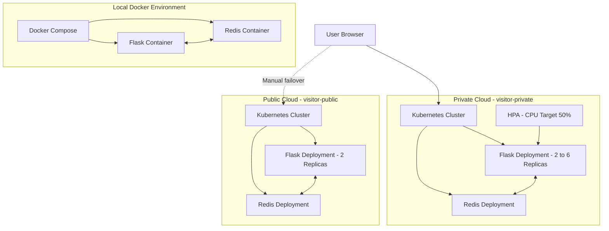

# Visitor Counter System Architecture

```mermaid
flowchart TD
    U[User Browser]

    subgraph LOCAL["Local Docker Environment"]
        D[Docker Compose]
        F1[Flask Container]
        R1[Redis Container]
        D --> F1
        D --> R1
        F1 <--> R1
    end

    subgraph PRIVATE["Private Cloud - visitor-private"]
        P[Kubernetes Cluster]
        P1[Flask Deployment - 2 to 6 Replicas]
        P2[Redis Deployment]
        H[HPA - CPU Target 50%]
        P --> P1
        P --> P2
        H --> P1
        P1 <--> P2
    end

    subgraph PUBLIC["Public Cloud - visitor-public"]
        Q[Kubernetes Cluster]
        Q1[Flask Deployment - 2 Replicas]
        Q2[Redis Deployment]
        Q --> Q1
        Q --> Q2
        Q1 <--> Q2
    end

    U --> P
    U -. Manual failover .-> Q
```
